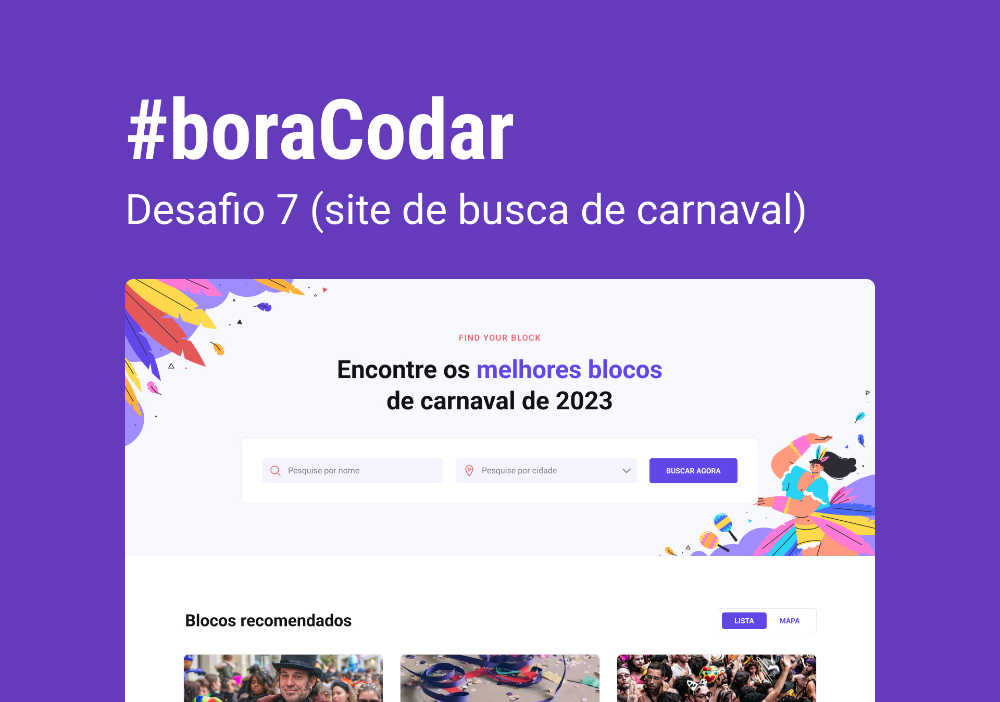

<h1 align="center"> Carnival Search Website </h1>

Projeto de uma página onde o usuário pode buscar por blocos de Carnaval.  

  <a href="#-tecnologias">Tecnologias</a>&nbsp;&nbsp;&nbsp;|&nbsp;&nbsp;&nbsp;
  <a href="#-layout">Layout</a>&nbsp;&nbsp;&nbsp;|&nbsp;&nbsp;&nbsp;
  <a href="#memo-licença">Licença</a>

  

 

  

<h2 align="center"><a href="https://isadoraguiar.github.io/bora-codar/07" target="_blank">Projeto ao vivo</a></h2>

### 🚀 Tecnologias

Esse projeto foi desenvolvido com as seguintes tecnologias:

- HTML e CSS
- Git e Github
- Figma

### O que aprendi nesse desafio:

- Organização de Github, readme, imagens, hacks para tabela de readme
- Input, Select e Button customizados
- Uso de ícones e fontes customizadas
- HTML: `form`, `header`, `main`, `section`, `form`, `select`, `img`,
- CSS: `all`, `overflow`, `::before`, `::after`, `rem`, `position`, `fit-content`, `flex e grid`, `@media` e `responsividade`
- Novo DevTools do Edge

### 🔖 Layout

Você pode visualizar o layout do projeto através [DESSE LINK](https://www.figma.com/community/file/1207675804423978995). É necessário ter conta no [Figma](https://figma.com) para acessá-lo.

### :memo: Licença

Esse projeto está sob a licença MIT.

---

Feito com ♥ por Isadora Aguiar :wave:
