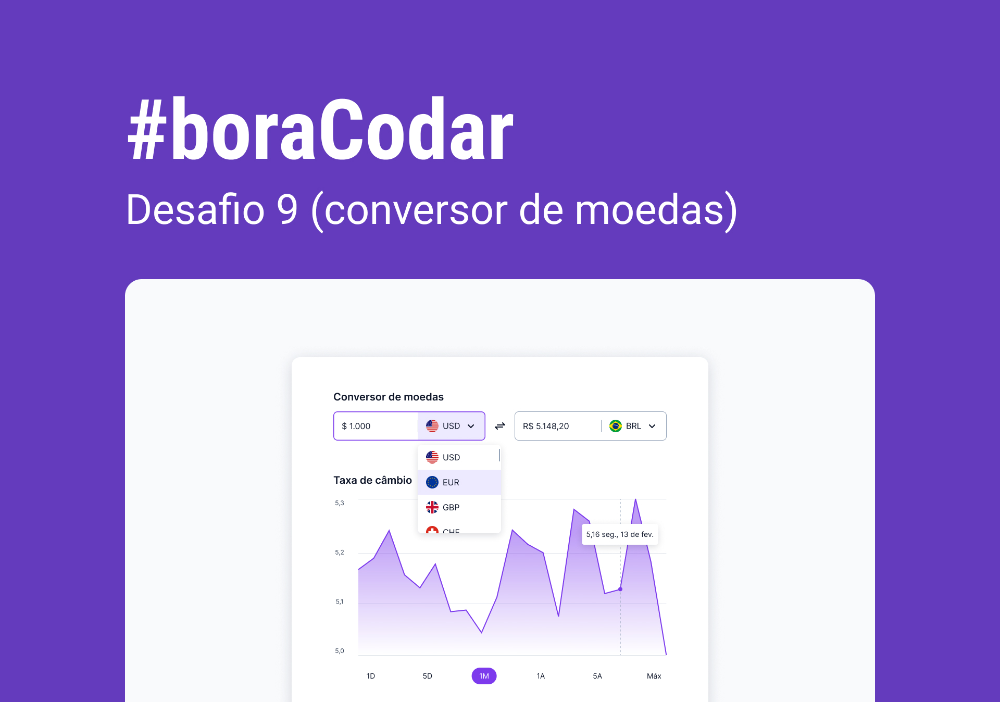

<h1 align="center"> Currency Converter </h1>

Projeto de um conversor de moedas, onde o usuário pode fazer conversões entre Real e Dólar.  

  <a href="#-tecnologias">Tecnologias</a>&nbsp;&nbsp;&nbsp;|&nbsp;&nbsp;&nbsp;
  <a href="#-layout">Layout</a>&nbsp;&nbsp;&nbsp;|&nbsp;&nbsp;&nbsp;
  <a href="#memo-licença">Licença</a>

  

 

  

<h2 align="center"><a href="https://isadoraguiar.github.io/bora-codar/09" target="_blank">Projeto ao vivo</a></h2>

### 🚀 Tecnologias

Esse projeto foi desenvolvido com as seguintes tecnologias:

- HTML e CSS
- Javascript
- Figma
- [Apex Charts](https://apexcharts.com/)
- [Flag Icons](https://github.com/lipis/flag-icons)

### 📚 Um pouco do que aprendi no desafio:

- `outline` x `border` CSS property
- Custom `<select>`
- Ícones com bandeiras `flag icons`
- Gráfico de area `area chart`
- Configuração do Apex Charts
- `String()` e `.replace()`

### 🔖 Layout

Você pode visualizar o layout do projeto através [DESSE LINK](https://www.figma.com/community/file/1212757179376046656). É necessário ter conta no [Figma](https://figma.com) para acessá-lo.

### :memo: Licença

Esse projeto está sob a licença MIT.

---

Feito com ♥ por Isadora Aguiar :wave:
