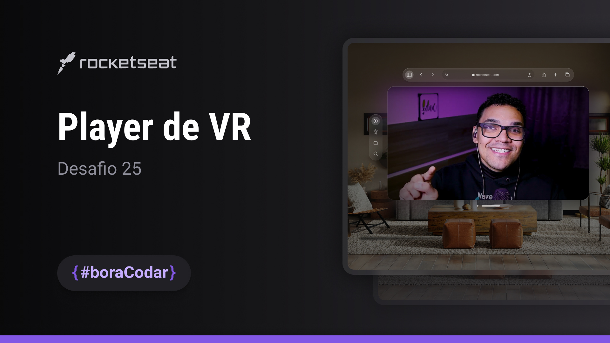

<h1 align="center"> VR Player </h1>

Projeto de uma versão web de uma experiência de player de vídeo em realidade virtual.  

  <a href="#-tecnologias">Tecnologias</a>&nbsp;&nbsp;&nbsp;|&nbsp;&nbsp;&nbsp;
  <a href="#-layout">Layout</a>&nbsp;&nbsp;&nbsp;|&nbsp;&nbsp;&nbsp;
  <a href="#memo-licença">Licença</a>

  

 

  

<h2 align="center"><a href="https://isadoraguiar.github.io/bora-codar/25" target="_blank">Projeto ao vivo</a></h2>

### 🚀 Tecnologias

Esse projeto foi desenvolvido com as seguintes tecnologias:

- HTML
- CSS
- Javascript
- Figma

### 🔖 Layout

Você pode visualizar o layout do projeto através [DESSE LINK](https://www.figma.com/community/file/1253345035290143826). É necessário ter conta no [Figma](https://figma.com) para acessá-lo.

### :memo: Licença

Esse projeto está sob a licença MIT.

---

Feito com ♥ por Isadora Aguiar :wave:
